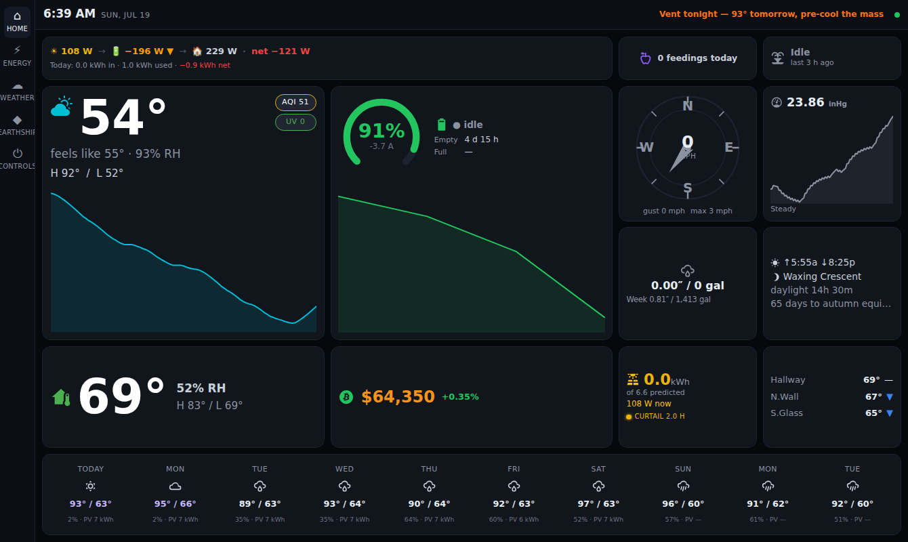
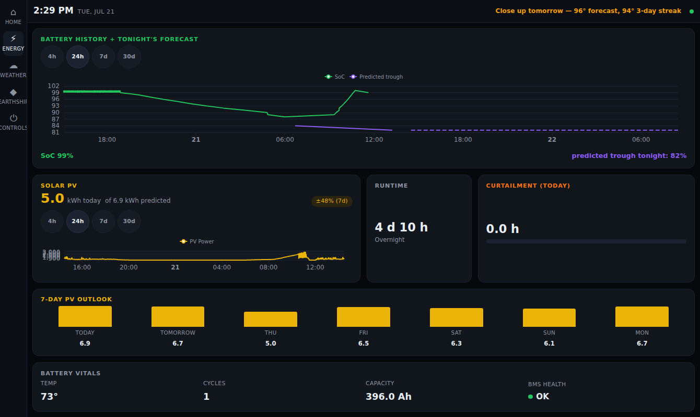
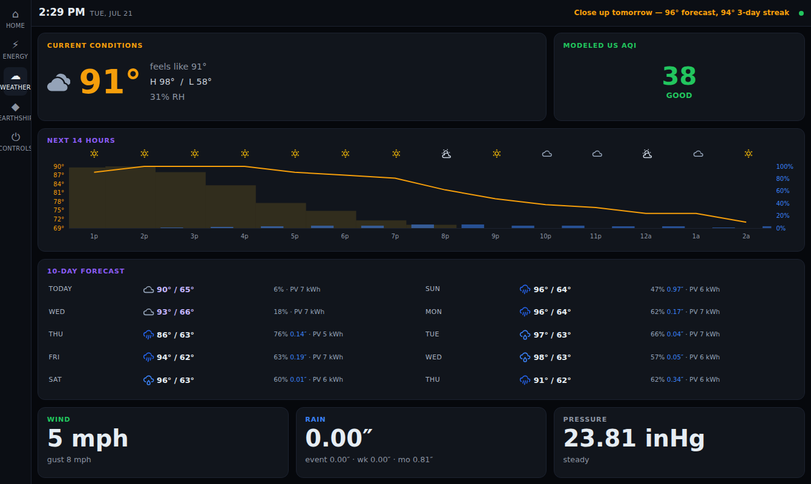
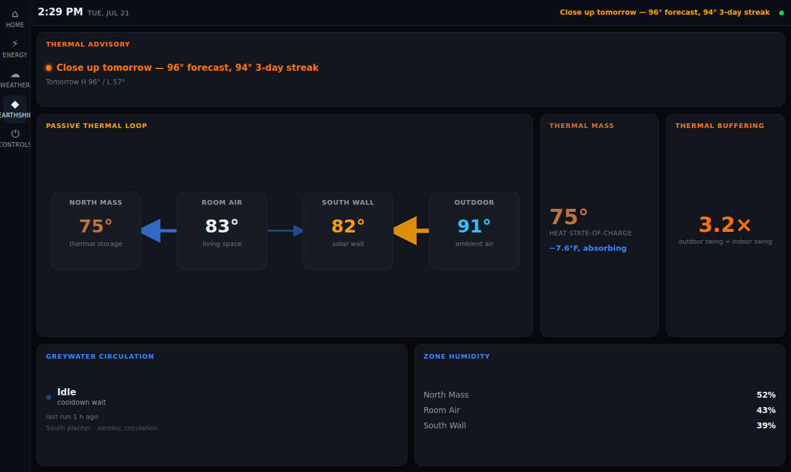
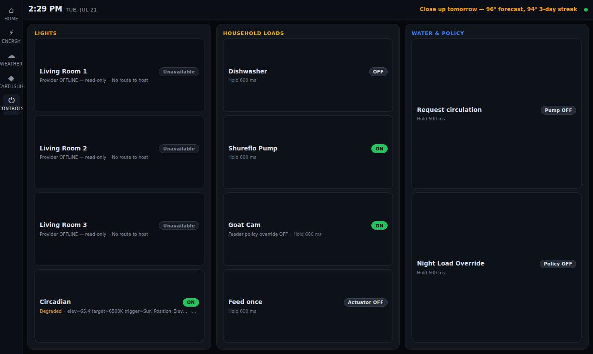
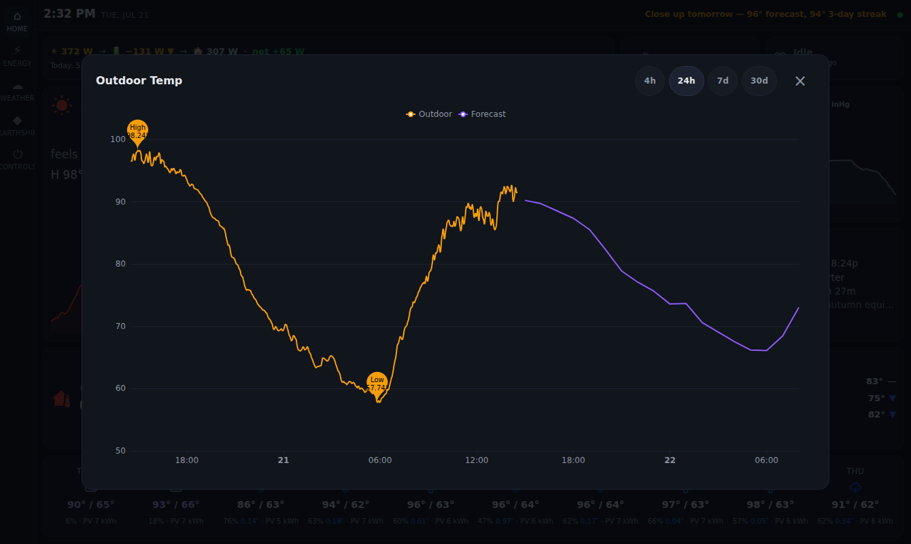
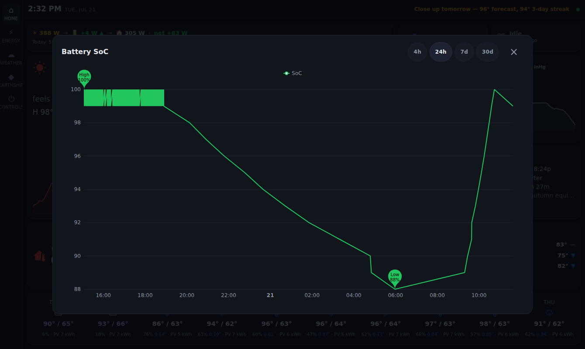
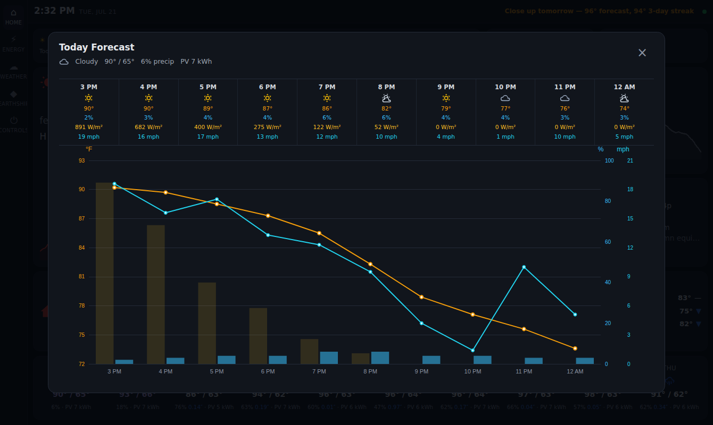

# Earthship Console UI

A custom household dashboard for our off-grid Earthship's openHAB system —
weather, battery/solar, passive-thermal loop, and greywater on one pane of
glass, styled after the Ambient Weather WS-2000 console.

**Primary device:** Lenovo Tab M9 (2023), landscape (1340×800), wall-mounted.
Laptop and phone are secondary. Tablet-first, no-scroll console layout.

**Stack:** Svelte + Vite + Tailwind, ECharts. Talks only to openHAB REST +
SSE on the LAN. PWA-installable.

**Status:** implemented and running on the household LAN. Five tablet-first
screens provide live monitoring and safety-gated controls.

## Screenshots

Captured from the live household console at the primary Lenovo Tab M9
landscape viewport (1340×800).

### Home

[](docs/screenshots/home.png)

### Energy

[](docs/screenshots/energy.png)

### Weather

[](docs/screenshots/weather.png)

### Earthship

[](docs/screenshots/earthship.png)

### Controls

[](docs/screenshots/controls.png)

### Detail modals

Tapping a tile opens its full history chart (with high/low extrema markers);
tapping a forecast day opens an hourly breakdown.

#### Outdoor temperature chart

[](docs/screenshots/modal-outdoor-chart.png)

#### Battery SoC chart

[](docs/screenshots/modal-battery-chart.png)

#### Weather day detail

[](docs/screenshots/modal-weather-detail.png)

## Service operations

The household runtime is the user-level `earthship-ui.service`, which serves
the Vite application on port 5190.

Reload the installed unit definition and restart the service:

```bash
systemctl --user daemon-reload
systemctl --user restart earthship-ui.service
systemctl --user status earthship-ui.service --no-pager -l
```

Inspect recent logs:

```bash
journalctl --user -u earthship-ui.service -n 100 --no-pager
```

Verify that Vite is transforming Svelte modules:

```bash
curl --fail --silent --show-error --output /dev/null \
  http://127.0.0.1:5190/src/App.svelte
```

Restart and verify the service after
branch switches, fast-forwards, or other tree-wide checkout changes. Vite hot
reload is not a deployment substitute for those operations.

## Config (not committed)

Runtime config lives in `config.json` (openHAB base URL + API token),
served alongside the static bundle. It is gitignored — never commit it.
Copy `config.example.json` and fill in your own values.
