# Earthship Console UI

A custom household dashboard for our off-grid Earthship's openHAB system —
weather, battery/solar, passive-thermal loop, and greywater on one pane of
glass, styled after the Ambient Weather WS-2000 console.

**Primary device:** Lenovo Tab M9 (2023), landscape (1340×800), wall-mounted.
Laptop and phone are secondary. Tablet-first, no-scroll console layout.

**Stack:** Svelte + Vite + Tailwind, ECharts. Talks only to openHAB REST +
SSE on the LAN. PWA-installable.

**Status:** implemented and running on the household LAN. Six tablet-first
screens provide live monitoring, safety-gated controls, and a shade preview.

## Screenshots

Captured at the primary Lenovo Tab M9 landscape viewport (1340×800). The
existing monitoring screens show the live household console; the shade images
crop to the shade page in an isolated preview with unconfigured shades and no
hardware commands.

### Home

[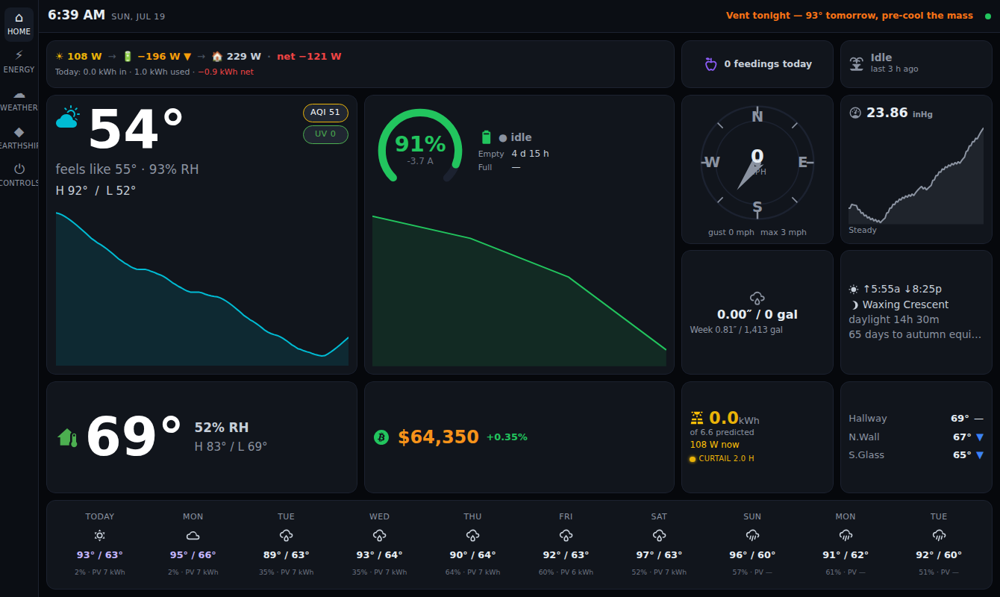](docs/screenshots/home.png)

### Energy

[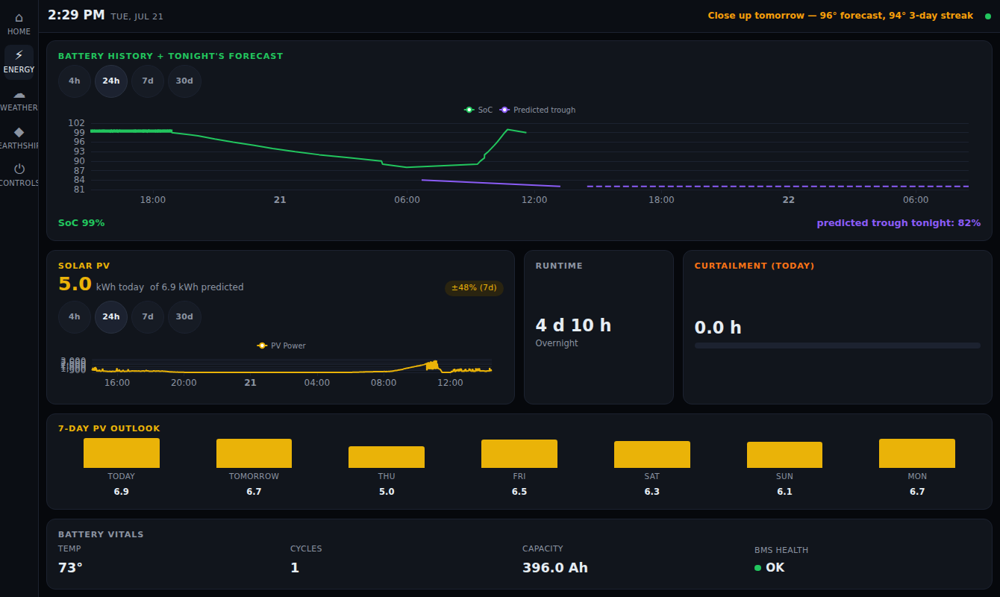](docs/screenshots/energy.png)

### Weather

[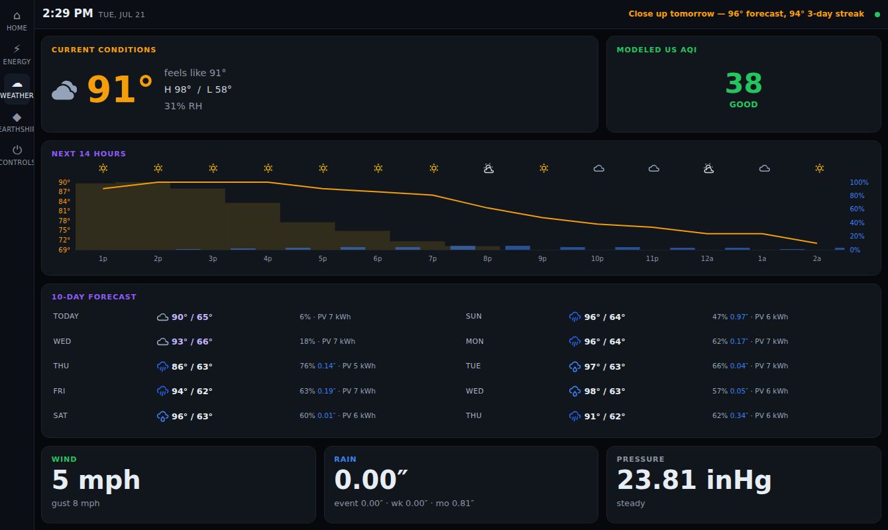](docs/screenshots/weather.png)

### Earthship

[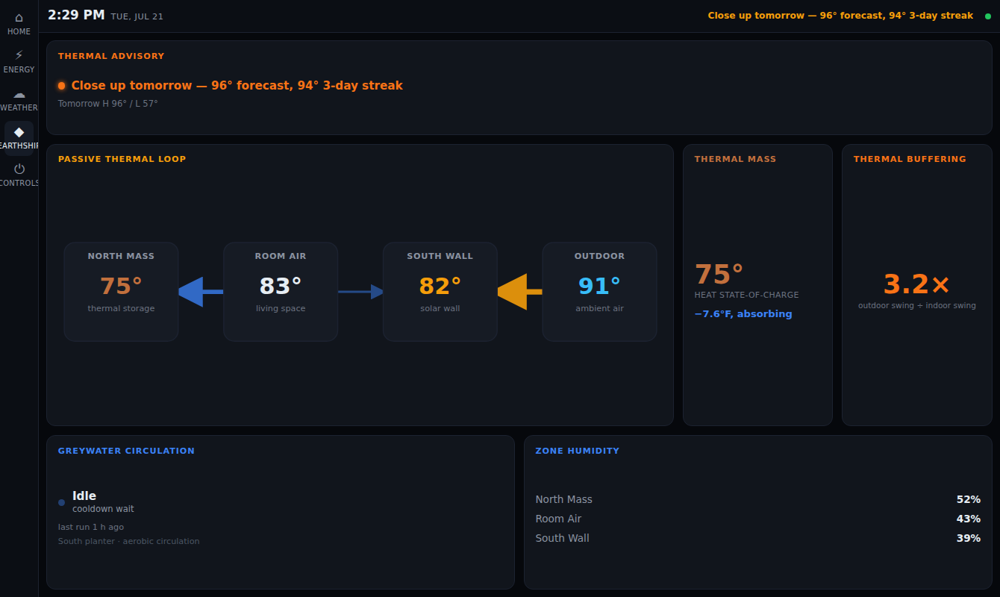](docs/screenshots/earthship.png)

### Controls

[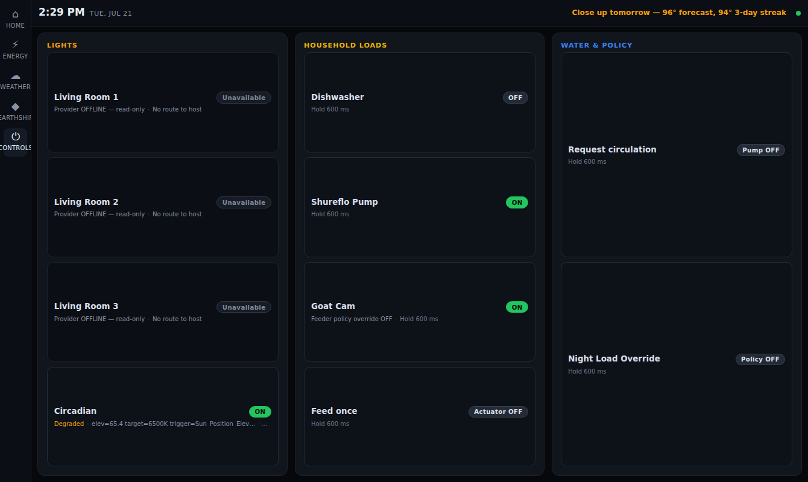](docs/screenshots/controls.png)

### Window shades — Kitchen and Living Room

[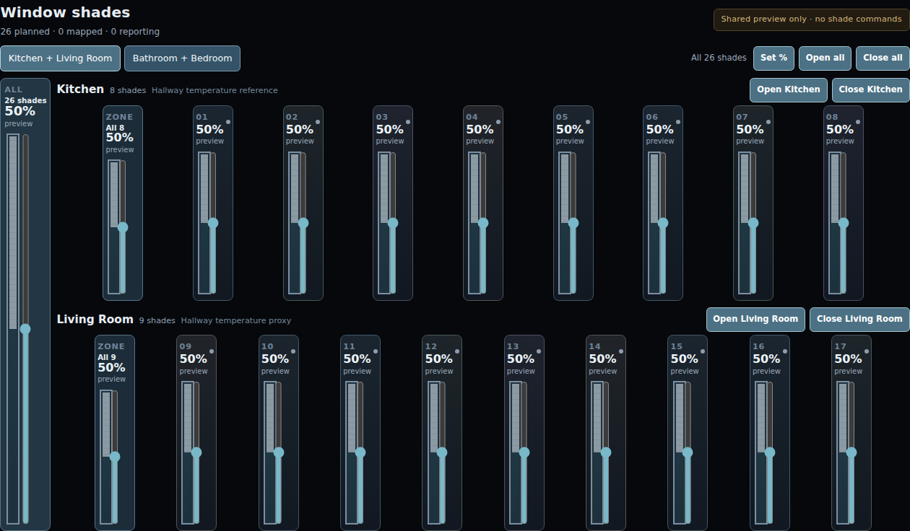](docs/screenshots/shades-kitchen-living.png)

### Window shades — Bathroom and Bedroom

[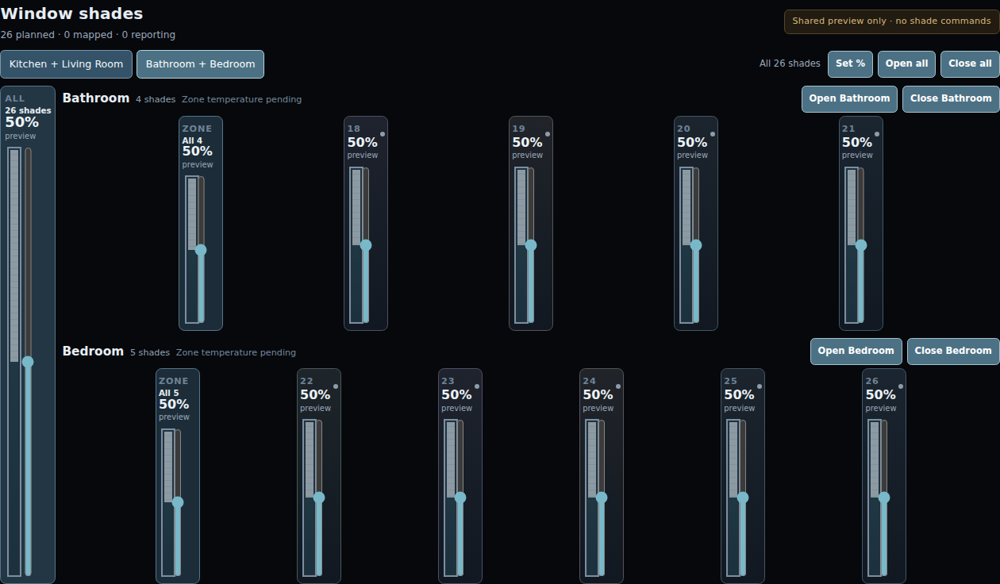](docs/screenshots/shades-bathroom-bedroom.png)

### Window shades — precise adjustment

[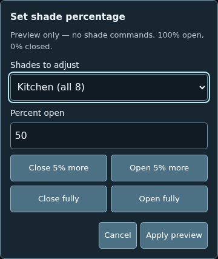](docs/screenshots/shades-percentage-editor.png)

The 26 shade slots and their all/zone/individual controls are preview-only
until hardware is mapped and commissioned. **Set %** selects an individual,
room, or all shades for exact percent-open entry, five-point steps, or full
open/close. Apply changes only the shared preview; Cancel leaves it unchanged.
Kitchen has 8 shades (1–8), Living Room 9 (9–17), Bathroom 4 (18–21),
and Bedroom 5 (22–26).
Regenerate these three images with
`node scripts/capture-shades-screenshots.mjs`.

### Detail modals

Tapping a tile opens its full history chart (with high/low extrema markers);
tapping a forecast day opens an hourly breakdown.

#### Outdoor temperature chart

[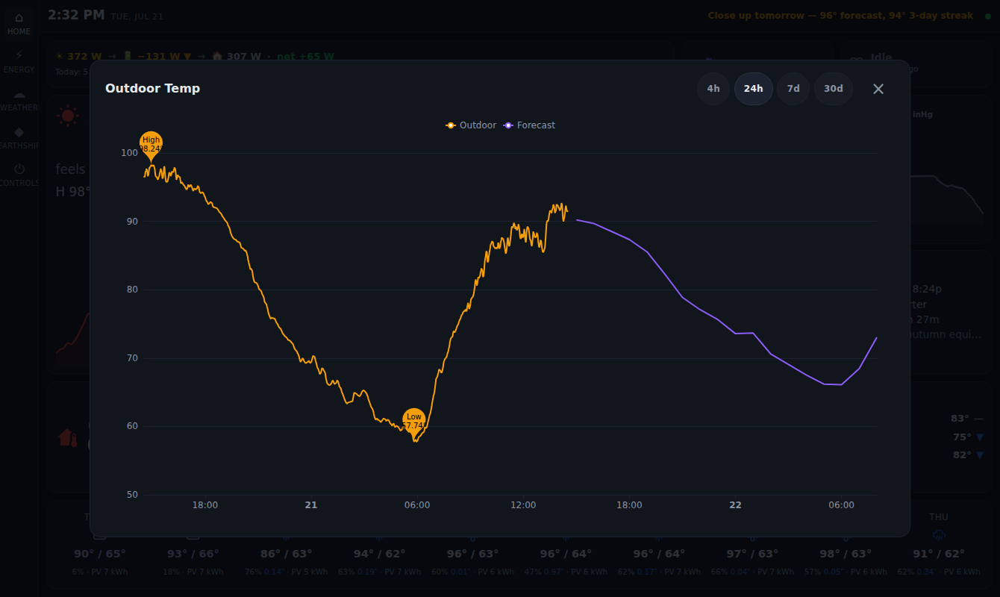](docs/screenshots/modal-outdoor-chart.png)

#### Battery SoC chart

[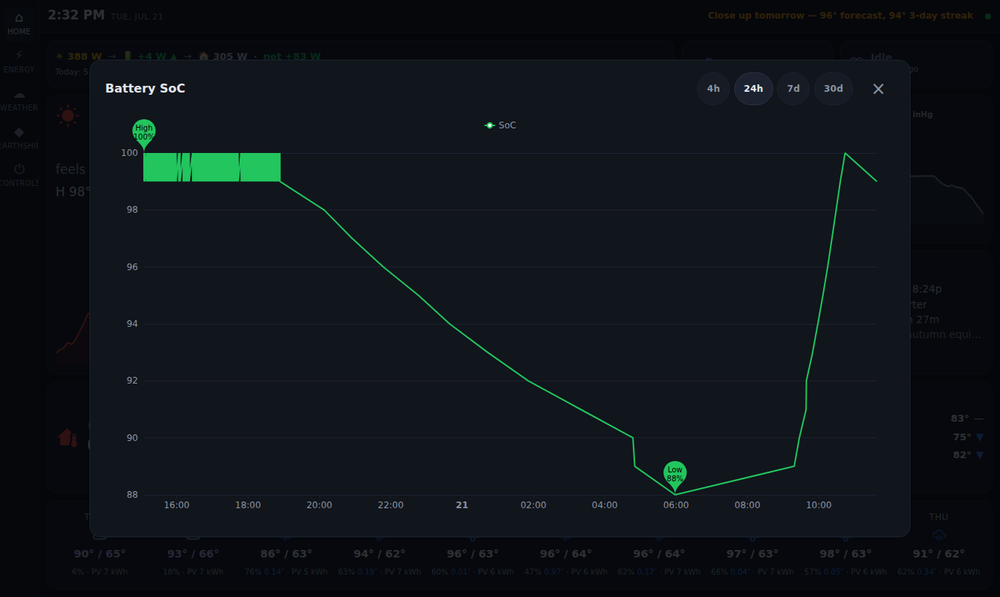](docs/screenshots/modal-battery-chart.png)

#### Weather day detail

[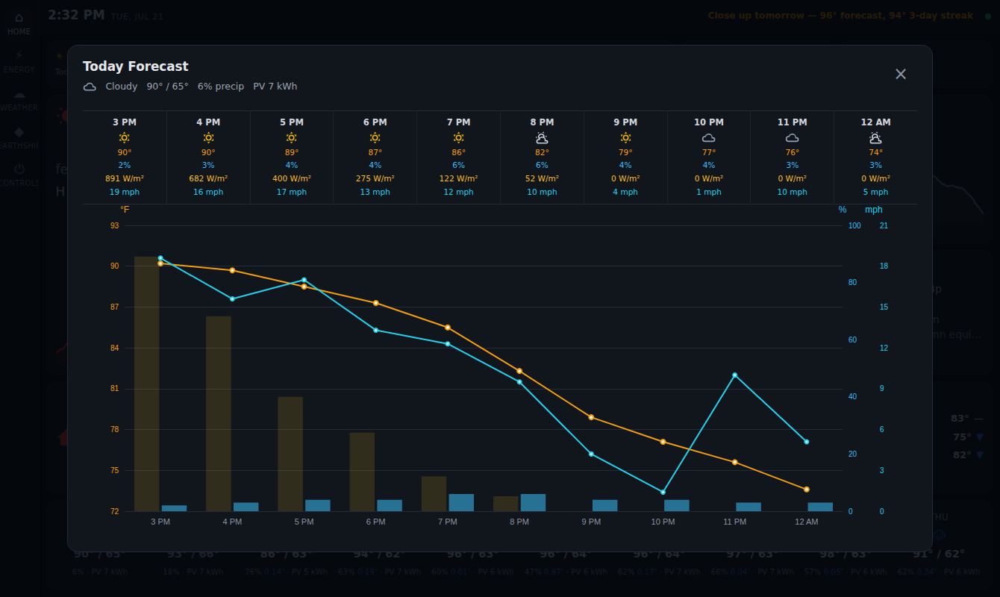](docs/screenshots/modal-weather-detail.png)

## Service operations

The household runtime is the user-level `earthship-ui.service`, which serves
the Vite application on port 5190.

Reload the installed unit definition and restart the service:

```bash
systemctl --user daemon-reload
systemctl --user restart earthship-ui.service
systemctl --user status earthship-ui.service --no-pager -l
```

Inspect recent logs:

```bash
journalctl --user -u earthship-ui.service -n 100 --no-pager
```

Verify that Vite is transforming Svelte modules:

```bash
curl --fail --silent --show-error --output /dev/null \
  http://127.0.0.1:5190/src/App.svelte
```

Restart and verify the service after
branch switches, fast-forwards, or other tree-wide checkout changes. Vite hot
reload is not a deployment substitute for those operations.

### Thermal model shadow operations

The repository stages user-level daily training and two-hour shadow-publishing
units in `deploy/thermal-model-{train,shadow}.{service,timer}`. They are not
installed or enabled by implementation. The thermal output remains
observational: it publishes only `Thermal_Model_JSON`, does not change
`Thermal_Advisory`, and has no actuator authority.

Thermal identification uses a rolling 400-day window so accepted artifacts
retain fall-charge, winter, spring, and warm evidence. The private artifact is
`earthship-thermal-model/v2`: its north-wall mass equation includes a bounded,
nonnegative mass-to-outdoor exchange, and v1 artifacts fail closed pending
retraining. The public shadow payload remains observational version 1. The attended runbook also
stages the hallway Philips sensor as `LivingOffice_Shade_Illuminance`,
`LivingOffice_Shade_Occupancy`, and `LivingOffice_Shade_Temperature`; collection
starts through the existing JDBC wildcard policy, with no photosensor-derived shade labels
in this change.

Use the attended, approval-gated
[thermal model shadow runbook](docs/operations/thermal-model-shadow.md) for the
exact tracked-to-live manifest, least-privilege PostgreSQL setup,
receipt-bound offline rehearsal, apply/closure/rollback, manual evidence review, service/timer
staging, durable transaction recovery, and rollback. The procedure is
first-install-only; if any thermal unit is already present, stop and use a
separately reviewed upgrade procedure. Completing implementation or collecting
shadow evidence does not graduate the model to advice.

## Config (not committed)

Runtime config lives in `config.json` (openHAB base URL + API token),
served alongside the static bundle. It is gitignored — never commit it.
Copy `config.example.json` and fill in your own values.
